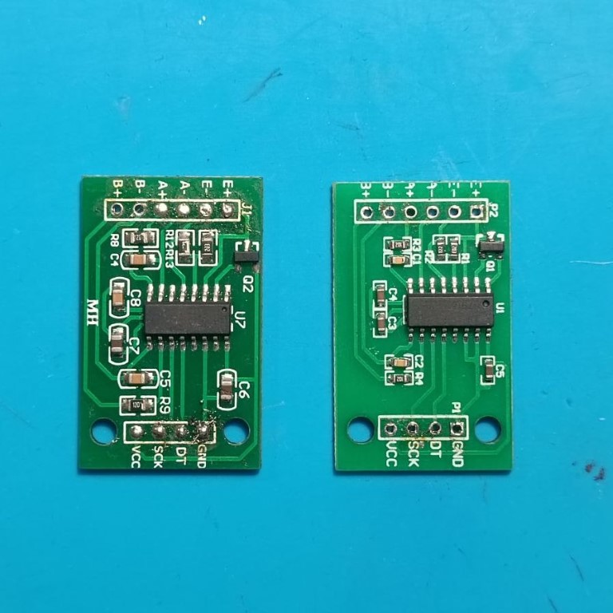

# Bilancia SaT

This project uses Arduino and various libraries to create a weighing system using an HX711 load cell amplifier, an LCD display, and a tare button. The program continuously reads the change in weight and displays it on both the Serial Monitor and the LCD screen. We also implemented a tare button to for reset the scale to zero when needed.

## Components Used

### Battery 9V

The 9V battery is used as a portable power source for the project.

### Touch Button (HW-139)

The HW-139 touch button is a component used for touch detection. It can be used as a tare button for resetting the scale.

### I2C 16x2 LCD Display

The I2C 16x2 LCD display is used to show information such as the measured weight or other relevant details.

### ON-OFF Switch

The ON-OFF switch is used to control the power supply to the circuit.

### ATtiny or Arduino Nano

The ATtiny or Arduino Nano is a microcontroller development board used for programming and controlling the scale and its components.

### 5KG Load Cell

The 5KG load cell is a weight sensor used to measure the weight of objects placed on the plate.

### HX711

The HX711 is used to amplify and convert the analog signal from the load cell into a digital one that can be read by the microcontroller.

### PCB Board

The PCB (Printed Circuit Board) is used to connect and organize the electronic components in the project.

## Wiring
The components are wired as follows:

HX711 load cell amplifier:
- LOADCELL_DOUT_PIN is connected to pin 3 of the Arduino board.
- LOADCELL_SCK_PIN is connected to pin 2 of the Arduino board.

LCD display (I2C interface):
- Address: 0x27
- Columns: 16
- Rows: 2

Tare button:
- Connect one terminal of the button to a digital input pin of the Arduino board.
- Connect the other terminal of the button to the ground (GND) pin of the Arduino board.
- Optionally, add a pull-up resistor between the digital input pin and the 5V pin of the Arduino board to ensure stable button readings. (We implemented it, if you want to add it, you can modify it in declaration part)

## Variables
The program uses the following variables:

- `calibration_factor`: This variable is used to calibrate the scale. It is a float value that can be adjusted based on the specific characteristics of the load cell and the desired measurement units.
- `units`: This variable stores the measured weight in grams.

## Setup
- Serial Monitor Initialization: The Serial Monitor is initialized with a baud rate of 115200.
- LCD Initialization: The LCD display is initialized using the above mentioned I2C address and the number of columns and rows.
- Button Initialization: The tare button pin is declared as an input, and if needed, a pull-up resistor is enabled.
- Scale Initialization: The HX711 scale is initialized with the specified data output pin and clock input pin.
- Raw Data Reading: The program reads the raw data from the scale using the `scale.read()` and `scale.read_average(20)` methods. This helps to determine the calibration factor.
- Calibration Factor Reading: The calibration factor is set using the `scale.set_scale()` method based on the raw data readings. The calibration factor adjusts the scale to provide accurate weight measurements.
- Tare Reading: The scale is tared using the `scale.tare()` method, which resets the scale to zero. This allows to measure the weight of objects neglecting the container's one.
- Serial and LCD Initialization Messages: Initialization messages are printed to the Serial Monitor and the LCD display to indicate that the setup process is completed.

## Main Loop
- Weight Measurement: The program continuously reads the change in weight using the `scale.get_units(10)` method. The 10 parameter represents the number of samples to average for a stable reading.
- LCD Output: The change in weight is displayed on the LCD screen by setting the cursor position and printing the weight value.
- Tare Functionality: If the tare button is pressed (HIGH state), the scale is tared again using the `scale.tare()` method. This allows for resetting the scale to zero when needed.
- Delay: The program waits for 100 milliseconds before reading the weight again. This delay helps to stabilize and to avoid rapid fluctuations of the measurements.

## Dependencies
The following libraries are required for this program to compile and run:

- Arduino.h: Provides the core Arduino functions and types.
- Wire.h: Enables communication with I2C devices.
- LiquidCrystal_I2C.h: Allows interfacing with I2C-based LCD displays.
- HX711.h: Provides the HX711 load cell amplifier functionality.

## Further Improvements
- You can modify the calibration factor (`calibration_factor`) to adjust the scale according to your specific load cell and measurement requirements.
- The program can be extended to support different measurement units by adding appropriate conversions and displaying the result in the desired unit on the LCD screen.
- Error handling and validation can be implemented to handle exceptional cases, such as when the load cell is not connected or when the measurements are out of range, making them block the execution of the entire program.
- You can compile this code to run also on other boards that are better for 3D printed cases (actually tested on Arduino Uno, ESP8266)

## License
This project is licensed under the MIT license.