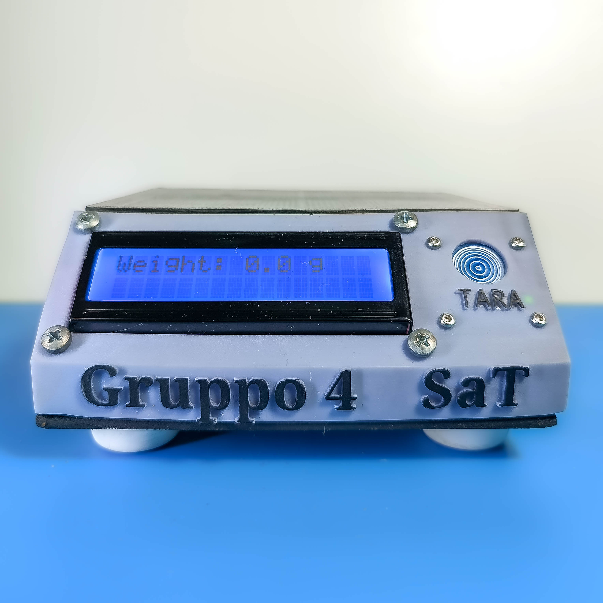
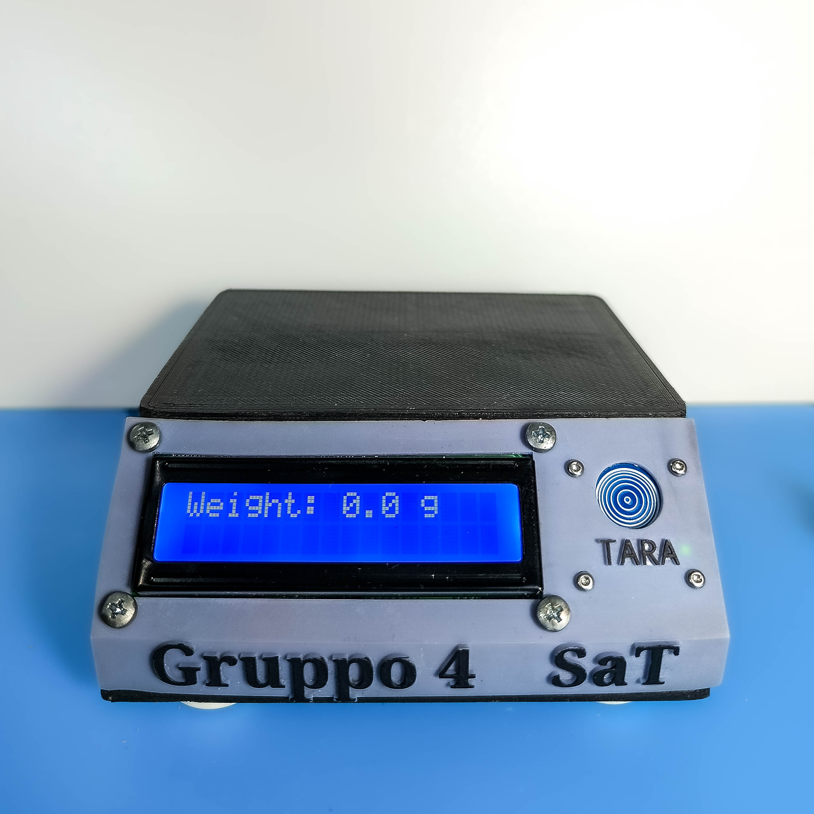
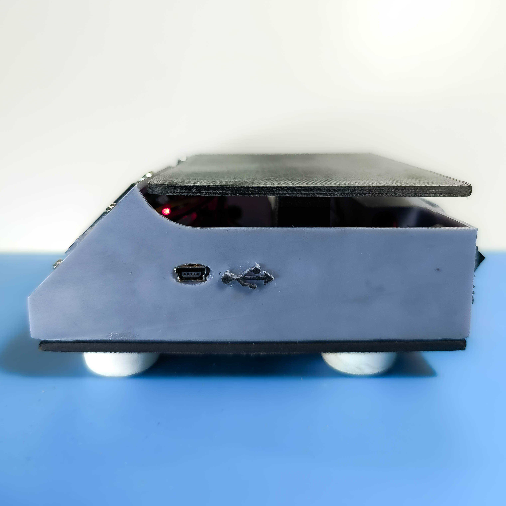
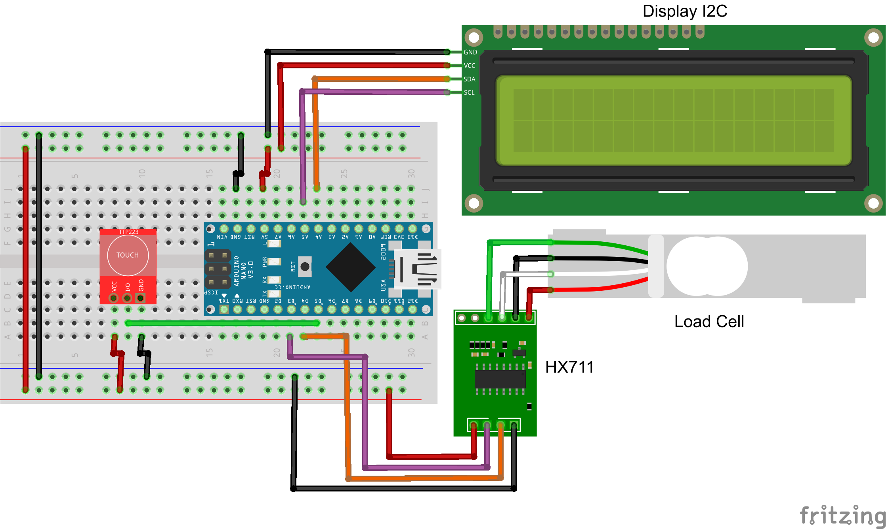

# Bilancia SaT

This project uses Arduino and various libraries to create a weighing system using an HX711 load cell amplifier, an LCD display, and a tare button. The program continuously reads the change in weight and displays it on both the Serial Monitor and the LCD screen. We also implemented a tare button to reset the scale to zero when needed.

## Example


## Front View



## Top View




## Bottom View


## Side View




## Back View


# Components Used

## Battery 9V


The 9V battery is used as a portable power source for the project.

## Touch Button (HW-139)


The HW-139 touch button is a component used for touch detection. It can be used as a tare button for resetting the scale.

## I2C 16x2 LCD Display


The I2C 16x2 LCD display is used to show information such as the measured weight or other relevant details.

## ON-OFF Switch


The ON-OFF switch is used to control the power supply to the circuit.

## ATtiny or Arduino Nano


The ATtiny or Arduino Nano are some examples of a microcontroller development board used for programming and controlling the scale and its components.

## 5KG Load Cell


The 5KG load cell is a weight sensor used to measure the weight of objects placed on the plate.

## HX711


The HX711 is used to amplify and convert the analog signal from the load cell into a digital one that can be read by the microcontroller.

## PCB Board


The PCB (Printed Circuit Board) is used to connect and organize the electronic components in the project.

## Rubber supports


# Wiring
The components are wired as follows:



HX711 load cell amplifier:
- LOADCELL_DOUT_PIN is connected to pin 3 of the Arduino board.
- LOADCELL_SCK_PIN is connected to pin 2 of the Arduino board.

LCD display (I2C interface):
- Address: 0x27
- Columns: 16
- Rows: 2

Tare button:
- Connect one terminal of the button to a digital input pin of the Arduino board.
- Connect the other terminal of the button to the ground (GND) pin of the Arduino board.
- Optionally, add a pull-up resistor between the digital input pin and the 5V pin of the Arduino board to ensure stable button readings. (We implemented it, if you want to add it, you can modify it in declaration part)

# Code

## Variables
The program uses the following variables:

- `calibration_factor`: This variable is used to calibrate the scale. It is a float value that can be adjusted based on the specific characteristics of the load cell and the desired measurement units.
- `units`: This variable stores the measured weight in grams.

## Setup
- Serial Monitor Initialization: The Serial Monitor is initialized with a baud rate of 115200.
- LCD Initialization: The LCD display is initialized using the above mentioned I2C address and the number of columns and rows.
- Button Initialization: The tare button pin is declared as an input, and if needed, a pull-up resistor is enabled.
- Scale Initialization: The HX711 scale is initialized with the specified data output pin and clock input pin.
- Raw Data Reading: The program reads the raw data from the scale using the `scale.read()` and `scale.read_average(20)` methods. This helps to determine the calibration factor.
- Calibration Factor Reading: The calibration factor is set using the `scale.set_scale()` method based on the raw data readings. The calibration factor adjusts the scale to provide accurate weight measurements.
- Tare Reading: The scale is tared using the `scale.tare()` method, which resets the scale to zero. This allows to measure the weight of objects neglecting the container's one.
- Serial and LCD Initialization Messages: Initialization messages are printed to the Serial Monitor and the LCD display to indicate that the setup process is completed.

## Main Loop
- Weight Measurement: The program continuously reads the change in weight using the `scale.get_units(10)` method. The 10 parameter represents the number of samples to average for a stable reading.
- LCD Output: The change in weight is displayed on the LCD screen by setting the cursor position and printing the weight value.
- Tare Functionality: If the tare button is pressed (HIGH state), the scale is tared again using the `scale.tare()` method. This allows for resetting the scale to zero when needed.
- Delay: The program waits for 100 milliseconds before reading the weight again. This delay helps to stabilize and to avoid rapid fluctuations of the measurements.

## Dependencies
The following libraries are required for this program to compile and run:

- Arduino.h: Provides the core Arduino functions and types.
- Wire.h: Enables communication with I2C devices.
- LiquidCrystal_I2C.h: Allows interfacing with I2C-based LCD displays.
- HX711.h: Provides the HX711 load cell amplifier functionality.

# 3D Printed parts

This project involves the creation of a scale using a combination of 3D-printed parts and electronic components. The modular design of the project allows for customization of the 3D-printed parts according to your specific needs.

## Parts Created

We have designed and printed several key parts for the scale, including:

- **Platform**: where the objects to be weighed are placed.


- **Alternative version of the Platform**: where the objects to be weighed are placed, with no screws in sight.


- **Load Cell Support**: securely holds the load cell in place.


- **Battery Cover**: to hide and protect the battery.


- **Body**: provides support to all the components and gives an aesthetically pleasing appearance.


These 3D-printed parts have been carefully designed to ensure proper functionality and compatibility with the electronic components used in the project.

## Replicating the Project

If you are interested in recreating this scale project at home, you can easily replicate the 3D-printed parts by downloading the provided design files. Simply import the files into your preferred 3D modeling software and adjust them to fit your specific printer and requirements. Once you have the 3D-printed parts, you can follow the instructions in the project documentation to assemble and integrate the electronic components.

# Test


## Calibration

We are trying to calibrate this scale using an iterative method to find the calibration factor and the offset that minimize the error between the actual weight and the measured weight. To do this, you can use the following formula:

$$
\text{Actual weight} = \text{Measured weight} \times \text{Cf} + \text{Offset}
$$

To calculate the error, we can use the following formula:

$$
\text{Error} = \sum_{i=1}^{n} (\text{Actual weight}_i - \text{Measured weight}_i \times \text{Cf} - \text{Offset})^2
$$

Where $n$ is the number of weights used in each iteration.

To find the Cf and the Offset that minimize the error, we use the gradient method, which consists of changing the values of Cf and Offset according to the derivative of the error with respect to them, using the following formulas:

$$
\text{New Cf} = \text{Cf} - \alpha \frac{\partial \text{Error}}{\partial \text{Cf}}
$$

$$
\text{New Offset} = \text{Offset} - \alpha \frac{\partial \text{Error}}{\partial \text{Offset}}
$$

Where $\alpha$ (also called Learning rate) is a parameter that controls the speed of convergence of the method, evaluating a value of $\alpha$ that is small enough to avoid oscillations, but large enough to reach the minimum in a few iterations.

To calculate the partial derivatives of the error, we need to use the following formulas:

$$
\frac{\partial \text{Error}}{\partial \text{Cf}} = -2 \sum_{i=1}^{n} (\text{Actual weight}_i - \text{Measured weight}_i \times \text{Cf} - \text{Offset}) \times \text{Measured weight}_i
$$

$$
\frac{\partial \text{Error}}{\partial \text{Offset}} = -2 \sum_{i=1}^{n} (\text{Actual weight}_i - \text{Measured weight}_i \times \text{Cf} - \text{Offset})
$$

In reality, for the calculation of Cf and offset, we are using an empirical formula, that is, adding the error with a certain weight to the previously calculated values:

$$
\text{New Cf} = \text{Cf} - \beta \times \text{Error}
$$

$$
\text{New Offset} = \text{Offset} - \beta \times \text{Error}
$$

Where $\beta$ is a kind of learning rate, suitably tuned to get progressively better results.

### Procedure

Wanting to go through the entire calibration process in depth:

- We prepared 6 iterations, with gradually smaller ranges, using sample weights:
    - Iteration 0: 0g-100g (10g increment)
    - Iteration 1: 0g-50g (increment of 5g)
    - Iteration 2: 0g-5.5g (0.5g increment)
    - Iteration 3: 0g-2g (0.2g increment)
    - Iteration 4: 0g-0.5g (increment of 0.05g)
    - Iteration 5: 0g-0.2g (increment of 0.02g)

- We placed each weight for 5 points of the plate (center and the four corners)

- Using MATLAB, we used a regression algorithm to fit the collected data The slope of the regression line represents the calibration factor and the intercept represents the offset, using the Euclidean norm (norm 2) to evaluate the error.

- Last we used the data calculated by calibration, using it when compiling the microcontroller program.

### MATLAB code

```
clear the workspace and the screen
reset the serial devices
```

```
set the number of objects
create a matrix of zeros to store the measures
create two vectors of zeros to store the weights
```

```
create and open a serial connection with the scale
```
```
wait until the scale is ready
```
```
for each object
    print a new line
    for each position from 1 to 5
        if the position is 1 (middle)
            ask the user to enter the known weight and place the object in the middle
            validate the input
            store the known weight in the vector x
            print a new line
        else if the position is 2 (bottom left)
            ask the user to place the object in the bottom left
        else if the position is 3 (top left)
            ask the user to place the object in the top left
        else if the position is 4 (top right)
            ask the user to place the object in the top right
        else if the position is 5 (bottom right)
            ask the user to place the object in the bottom right
        send a signal to the scale
        read the measured value from the scale
        store the measured value in the matrix measures
        print the measured value
    end for
end for
```

```
close and delete the serial connection
reset the serial devices
```
```
for each object
    calculate the average of the measures for that object
    store the average in the vector y
end for
```
```
create a table with the vectors x and y
save the table as a text file
save the table as a csv file
```
```
find the coefficients of the best fitting line for the data
the slope is the calibration factor
the intercept is the offset
evaluate the line at the known weights
compute the error vector
compute the error norm
print the error
```
```
create and clear a figure
plot the data as green circles
plot the line as a solid line
```

### Stop condition

For calibration, we have to find the right compromise to make the regression line fit, considering that we have to use a smaller and smaller range of weights until we arrive at a measurement that is not fouled by noise in such a way that the behavior of the scale is no longer linear. We found that up to the third iteration we still have linear behavior, with a larger error than in the second iteration, as the distance between the points and the line increases. Using a smaller range would mean that the measurements are greatly affected by noise, increasing the error as we try to fit a line into a nonlinear set of points.

#### Iteration 0


------

#### Iteration 1


------

#### Iteration 2


------

#### Iteration 3


------

#### Iteration 4


> [!NOTE]
> In this graph, it can be seen that variations on the order of hundredths of a gram are not appreciable, as the noise mat is of the same order of magnitude, so it makes the regression results much worse when calculating Cf and offset. Taken this into account, the 5th iteration wouldn't have much meaning.

------

### Results

In truth, already the first iteration returns us a plausible value of Cf, but this can be further improved. The same applies to the offset as well. The best result was achieved at the second iteration, when the range of values is small, but the variations between weights are still appreciable. In addition, we noticed that when the variation falls below 0.5 grams it starts to feel particularly noisy, so the measurements are more degraded. This, counterintuitively gives worse results, and as can be seen from the third iteration, will give a larger error and worse Cf and offset values than those calculated before.

## Noise

The purpose of the noise test was to evaluate the accuracy and stability of the balance without any weights on it. We expected the balance to output zero or very small values when no weight was applied. However, due to various sources of noise, such as electrical interference, mechanical vibrations, or environmental factors, the balance might output some non-zero values.

To perform the noise test, we collected 100 samples from the balance using Matlab, receiving a floating-point number representing the weight in grams from the scale. We repeated this process 100 times and stored the values in a vector n. We also saved the data in a table T and exported it to a text file and a csv file.

We then analyzed the data using Matlab. We calculated the mean and the standard deviation of the vector n to get an estimate of the average noise level and the noise variance. We also plotted the frequency spectrum of the vector n using the discrete Fourier transform (DFT) to identify any dominant frequency components in the noise.

The results of the noise test are shown below. The mean of the vector n is 0.12 g and the standard deviation is 0.07 g. This means that the balance has a very low noise level and a high accuracy. The frequency spectrum of the vector n shows that the noise is mostly random and does not have any significant peaks. This means that the balance is stable and does not suffer from any periodic disturbances.

### MATLAB code

```
clear the workspace and the screen
reset the serial devices
```
```
Set N to 100
Create a vector of N elements, initialized to zero
```

```
create and open a serial connection with the scale
```
```
wait until the scale is ready
```
```
For each element of the vector
    Receive a numeric value from the device
    Save the value in the vector and print it on the screen
End for
```
```
Compute the DFT
```
```
Compute the mean and the standard deviation of the original vector
```

## Repeatability

Like any instrument, electronic scales can suffer from repeatability problems. This means that when the same load is measured multiple times, the result is not always exactly the same. To find out the repeatability of the instrument, a repeatability test is performed.

The repeatability test is performed by replacing the same load at the same point on the weighing plane (to avoid any eccentricity error) several times. The test must be performed under identical and constant conditions and with identical handling.

The calibration weight used should have a size as close as possible to the maximum range of the instrument. Often a repeatability test is performed with a single load, but it can also be performed with different load values, separately.

A repeatability test is normally performed by repeating the measurement at least 5 times in a row. We did two tests:

- 20g
    - mean: 99.97g
    - stdev: 0.0141
    


------

- 100g
    - mean: 20.02g
    - stdev: 0.0235


------

In the repeatability test, the instrument is first zeroed, then the load is placed on the plate and the indication is recorded once stabilized. Then the load is removed and the zero indication is checked and zeroed if necessary. Then the load is replaced and so on. For a scale with multiple fields / divisions, a test weight below the first range should be sufficient.

### MATLAB code

```
clear the workspace and the screen
reset the serial devices
```
```
Set N to 5
Create a vector of N elements, initialized to zero
Ask the user to remove any object from the scale
```

```
create and open a serial connection with the scale
```
```
wait until the scale is ready
```
```
For each element of the vector
    Ask the user to place the object on the scale
    Receive a numeric value from the device
    Save the value in the vector and print it on the screen
    Ask the user to remove the object from the scale
End for
```
```
Close and delete the serial connection
```
```
Compute the mean and the standard deviation of the original vector
```

## Eccentricity

Eccentricity tests are performed on weighing instruments to measure how the position of the load affects the accuracy and repeatability of the readings. The principle of the test is to compare the indications of the instrument when the same load is applied at different locations on the load receptor. The locations are chosen according to the shape and the number of support points of the load receptor, following the standards OIML R76 and EN 45501. The test load should be at least one third of the maximum capacity of the instrument, and preferably a single load, to ensure the consistency of the center of gravity.


-----

The test procedure consists of placing the test load at the center of the load receptor and recording the indication. Then, the load is moved to four other locations, usually at the corners or the edges of the load receptor, and the indications are recorded again. The load is then returned to the center and the indication is checked for any drift. The zero of the instrument may be verified and adjusted between each location, if needed. Alternatively, the instrument may be tared when the load is at the center, to make the differences between locations more visible.

The test is considered passed if the differences between the indications at different locations are within the permissible errors specified by the standards or the manufacturer. The differences are also used to calculate the eccentricity error, which is the maximum deviation of the indication from the arithmetic mean of all indications. The eccentricity error is an important parameter to evaluate the performance and the quality of the weighing instrument.


### MATLAB code

```
clear the workspace and the screen
reset the serial devices
```
```
Set N to 5
Create a vector of N elements, initialized to zero
Ask the user to remove any object from the scale
```

```
create and open a serial connection with the scale
```
```
wait until the scale is ready
```
```
For each position of the scale
    Ask the user to place the object on the scale
    Receive a numeric value from the device
    Save the value in the vector and print it on the screen
    Ask the user to remove the object from the scale
End for
``` 
```
Close and delete the serial connection
```
```
Compute the mean and the standard deviation of the original vector
```
```
Save the data in a table with two columns: measured weight and error
```


## Hysteresis

Hysteresis refers to the difference in a system’s output when a specific input is approached from increasing and decreasing directions. In weighing tests, it’s crucial not to overshoot or undershoot the load to accurately identify hysteresis. The instrument should be calibrated with increasing and decreasing points, approaching each test point with increasing or decreasing weight respectively.

Multiple points throughout the instrument’s measurement range are used to reveal any linearity issues, which means the instrument does not measure equally accurate throughout its range. Even if the zero and full span are correct, there may be errors in the middle of the range, referred to as linearity errors, or non-linearity.

The purpose of a weighing test is to test the calibrated accuracy of the weighing instrument across its entire range, in several steps, with increasing and decreasing weight. Typically, 5 to 10 different loads (test points) are used, and each range must be calibrated separately in multi-range instruments.

### MATLAB code

```
clear the workspace and the screen
reset the serial devices
```
```
Set N to 5
Create a vector of 2*N elements, initialized to zero
Ask the user to remove any object from the scale
```

```
create and open a serial connection with the scale
```
```
wait until the scale is ready
```
```
For each measurement, up to N
    ask the user to enter the known weight (ascending order)
    Receive a numeric value from the device
    Save the value in the vector and print it on the screen
    Ask the user to remove the object from the scale
End for
``` 
```
For each measurement, for N+1 up to 2*N
    ask the user to enter the known weight (descending order)
    Receive a numeric value from the device
    Save the value in the vector and print it on the screen
    Ask the user to remove the object from the scale
End for
``` 
```
Close and delete the serial connection
```
```
???
```
```
plot the data
```


# Further Improvements
- You can modify the calibration factor (`calibration_factor`) to adjust the scale according to your specific load cell and measurement requirements.
- By using the purple hx711, that has bigger and more separated tracks, it is possible to benefit from an improvement in terms of precision, since the entity of the disturbances is smaller.
  
- The program can be extended to support different measurement units by adding appropriate conversions and displaying the result in the desired unit on the LCD screen.
- Error handling and validation can be implemented to handle exceptional cases, such as when the load cell is not connected or when the measurements are out of range, making them block the execution of the entire program.
- You can compile this code to run also on other boards that are better for 3D printed cases (actually tested on Arduino Uno, ESP8266)

# License
This project is licensed under the GPLv3 license.
